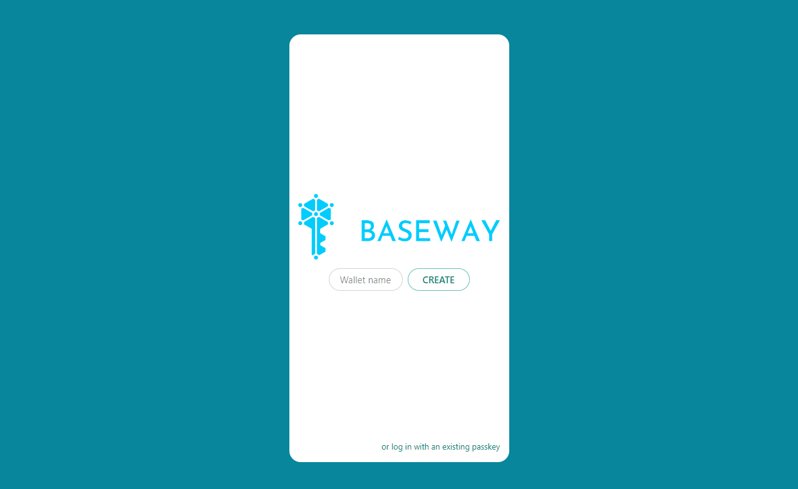
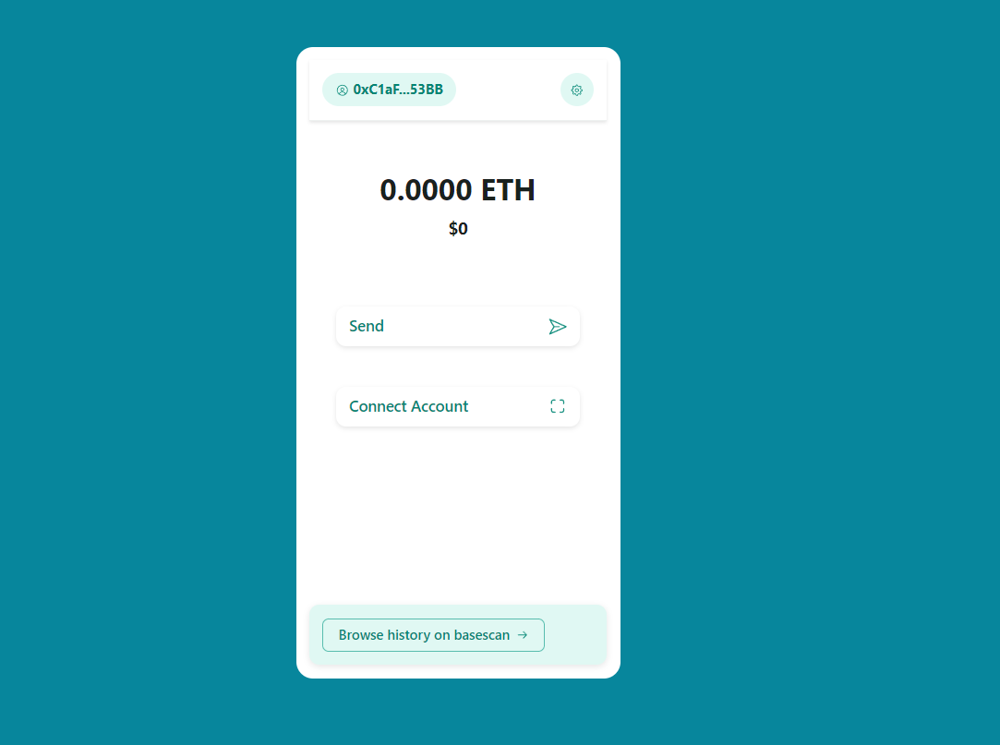

<h1 align="center" style="margin-bottom: 0">BASEWAY WALLET</h1>

The Baseway wallet simplifies the user onboarding experience through a smooth one-click process. Leveraging the functionalities of account abstraction and passkeys, users can easily generate passkey credentials, set up a smart account, and deploy—all with just a single click on their smartphone or computer. The wallet operates discreetly, ensuring a seamless and hassle-free experience for users.

 

# MOTIVATION

Blockchain is a revolutionary technology with the potential to solve a wide range of societal challenges, offering solutions across industries such as decentralized finance (DeFi), gaming, healthcare, supply chain management, and more. Its decentralized nature enables transparent, secure, and tamper-proof interactions, eliminating the need for intermediaries and enhancing trust in systems. 

However, despite its vast potential, the blockchain ecosystem remains challenging for non-technical users to navigate. Many aspects—such as setting up wallets, managing private keys, understanding gas fees, and ensuring secure key storage—can seem complex and intimidating. For the average user unfamiliar with these technical concepts, onboarding becomes a significant hurdle, hindering widespread adoption and preventing individuals from accessing the full benefits of blockchain technology.

#### User Onboarding Challenges in Blockchain

Onboarding new users into blockchain applications is one of the biggest obstacles to mass adoption. Current wallet solutions require users to generate and store mnemonic phrases (a sequence of 12 or 24 words) to recover their accounts. While this system ensures decentralization and control over assets, it also introduces security risks. Users who lose or improperly store their mnemonics may permanently lose access to their funds. At the same time, managing these sensitive recovery phrases can feel cumbersome, especially for those unfamiliar with cybersecurity practices. 

This reliance on mnemonics places the burden of security entirely on users, creating a friction point that discourages new participants. Blockchain solutions must evolve to offer smoother, more user-friendly experiences—abstracting away complex processes, providing intuitive interfaces, and integrating familiar recovery methods like biometric authentication or social logins. 

Ultimately, making blockchain accessible to the everyday user is essential for realizing its transformative potential and achieving mainstream adoption across industries.

# Objective of Baseway wallet

Baseway Wallet aims to tackle the challenges of blockchain onboarding through the integration of **account abstraction** and **passkeys**. This innovative approach ensures a seamless and intuitive user experience, allowing users to set up their wallets with just a single click on their smartphone or laptop. By eliminating the need for complicated mnemonic phrases and private key management, users can effortlessly generate passkey credentials and set up **smart accounts**, drastically simplifying the onboarding process and enhancing convenience.

Account abstraction decouples complex blockchain operations from the user, allowing actions like signing transactions or paying gas fees to happen behind the scenes. This abstraction makes interacting with decentralized applications (dApps) feel as easy as using a traditional Web2 app. The use of **passkeys**, which rely on biometrics or hardware-based authentication, adds an extra layer of security without compromising usability.

### Current Features of Baseway Wallet

- **Web Version**: The wallet is accessible directly through a web interface, ensuring cross-platform availability and eliminating the need for cumbersome installations.
- **Telegram Mini Wallet Integration**: Baseway Wallet is integrated with **Telegram’s Mini Apps**, enabling users to access wallet functionalities seamlessly within the familiar Telegram environment. This integration offers a lightweight, Web2-like experience, making it easier for new users to engage with blockchain applications without friction. (currenlty support telegram desktop and web version).

Baseway Wallet exemplifies how user-friendly design, combined with cutting-edge technologies like account abstraction and passkeys, can overcome the barriers to blockchain adoption. By streamlining the onboarding process and integrating with popular platforms, it ensures that even non-technical users can interact with blockchain networks effortlessly, paving the way for broader adoption across industries.

Baseway Wallet further enhances usability by supporting **any decentralized application (dApp)** through **WalletConnect** integration. This feature allows users to interact with a wide range of dApps without requiring additional steps or modifications from developers.

### Seamless dApp Compatibility with WalletConnect

By leveraging WalletConnect, Baseway Wallet provides a standardized connection between wallets and dApps, enabling users to easily link their wallet to any compatible dApp with just a QR code scan or deep link. This approach ensures:

- **Instant dApp Access**: Users can connect to DeFi platforms, NFT marketplaces, games, and more, directly from the Baseway Wallet.
- **No Developer Adjustments Required**: dApp developers do not need to modify or update their code to integrate Baseway Wallet into their applications. The WalletConnect protocol ensures that existing dApps are automatically compatible.
- **Familiar User Experience**: Users benefit from a consistent interaction pattern across various dApps, simplifying the way they manage blockchain-based activities.

With its **plug-and-play compatibility** via WalletConnect, Baseway Wallet removes friction for both developers and users, creating an ecosystem where blockchain applications are accessible to everyone. This approach lowers entry barriers, helping drive mass adoption by offering a smooth, secure, and intuitive experience for all.

# How It Works in Practice

Step 1:  

 

To create a wallet, users can either access the **Telegram Mini Wallet app** or visit the **Baseway Wallet website**. The setup is quick and straightforward:

1. **Choose a Username**: Users start by selecting a unique username for their wallet.
2. **Create Wallet**: After entering the username, clicking the **"Create Wallet"** button completes the process.

That’s it—your wallet is ready!

During the wallet creation process, a **passkey** is securely generated **on the client side**, ensuring that sensitive credentials remain private and never leave the user’s device. This approach not only simplifies onboarding but also ensures high-level security, eliminating the need for mnemonic phrases or manual key management.

Step 2:    

Once the wallet is created, the user is redirected to a page displaying the **new account details**, including the **public wallet address**. From this page, users can:

- **Send Tokens**: Use the displayed address to send or receive tokens from other wallets or dApps.
- **Copy Wallet Address**: Easily copy the address for sharing or transactions.
- **Access Additional Features**: Manage assets, view transaction history, and connect to dApps using WalletConnect.

### Secure Account Creation with Passkeys

When you create an account with Baseway Wallet, a **passkey** is automatically generated and securely stored on your **device** or in your **password manager**. This passkey plays a crucial role in securing your wallet, as it is tied to a unique identifier (ID) for your account. Importantly, the wallet itself never manages or stores your passkey—ensuring maximum security and user privacy.

#### How the Passkey System Works

- **Local Generation & Storage**: The passkey is generated directly on your device during the account creation process and stored locally in your password manager or the device’s secure enclave (such as Apple's Secure Enclave or Android's Keystore).
- **Interaction through Browser API**: The Baseway Wallet doesn’t have direct access to the passkey. Instead, it interacts with it indirectly by using the **browser’s WebAuthn API**. This API facilitates secure communication between the wallet and your passkey.

#### How Authentication Works

Whenever the wallet requires a signature for transactions or interactions, it simply sends a request to the **browser’s API**, which prompts your device or password manager to verify and authorize the action. Once approved, the device handles the cryptographic operation and sends the signature back to the wallet—without ever exposing the passkey itself.

#### Key Security Advantages

1. **Wallet Never Stores Passkeys**: Since the passkey remains securely within your device or password manager, the wallet cannot be compromised to steal it.
2. **Reduced Attack Surface**: Even if the wallet interface is attacked or compromised, your passkey remains protected, as it is never directly handled or exposed by the wallet.
3. **Phishing Protection**: Because authentication relies on local devices or biometric data, attackers cannot steal credentials through phishing techniques.

This **passkey-based security model** provides a **frictionless and highly secure user experience**, eliminating the need for mnemonic phrases and making blockchain interactions as simple as using a Web2 application. By abstracting complex key management, Baseway Wallet ensures both **security** and **ease of use**, empowering users to explore blockchain technology confidently.

### Smart Account Creation in Baseway Wallet

The **Smart Account** is a key feature of Baseway Wallet, designed to simplify on-chain interactions through seamless integration with **ERC-4337** (Account Abstraction). This contract-based account provides enhanced flexibility by using **smart logic for signature verification** and transaction management, allowing users to operate blockchain applications with their **passkey**.

#### **How Smart Accounts Work**

- **Address Generation**:  
  The address of the Smart Account is **deterministically computed** from the user's **public key**. This ensures that the same address is always associated with the user’s passkey without requiring prior deployment of the contract.
- **Passkey-Based Operation**:  
  The Smart Account leverages the **user's passkey** for authentication. Each time the user interacts with the blockchain, the contract uses cryptographic operations to verify the **signature** from the passkey, ensuring secure and permissioned transactions.

#### **Efficient Deployment to Save Gas Fees**

The Smart Account **is not deployed immediately** when the passkey is generated. This design avoids **unnecessary gas fees** for a contract that might never be used. Instead, the contract is only deployed when the user initiates their **first on-chain interaction** (e.g., sending a token or interacting with a dApp). This **on-demand deployment** ensures:

- **Cost Efficiency**: Users only pay deployment costs when they actively need the contract.
- **Optimized Usage**: Prevents the network from being burdened with unused contracts, contributing to a more efficient blockchain ecosystem.

#### **Key Benefits of Smart Accounts in Baseway Wallet**

1. **Seamless User Experience**: Users can manage their accounts and interact with dApps using familiar passkey-based authentication without worrying about blockchain-specific complexities.
2. **Enhanced Security**: Since the passkey handles signature verification, users never need to manage private keys or mnemonic phrases.
3. **Gas Optimization**: The Smart Account only deploys when necessary, ensuring users don't incur costs for contracts they don’t use.
4. **Scalable Infrastructure**: The deterministic address allows users to share their wallet address confidently, knowing the contract will be deployed when needed without changing the address.

By integrating **ERC-4337 Smart Accounts**, Baseway Wallet bridges the gap between **usability and security**, making blockchain interactions as simple as traditional Web2 logins while maintaining the benefits of decentralization and user control. This approach ensures that **any user, technical or not, can interact with the blockchain seamlessly** and without the need for extensive setup or technical knowledge.

# Paymaster and Bundler

### Custom Paymaster and Bundler Implementation

At Baseway Wallet, we have developed a **custom Paymaster** and **bundler** to enhance our blockchain integration and improve the user experience. The bundler is a modified version of the **Eth-Infinitum bundler**, tailored to meet our specific requirements and streamline interactions within the wallet.

#### Current Configuration

- **Stackup Bundler**: In our current online version, we are utilizing the **Stackup bundler**. This bundler facilitates efficient transaction processing and enhances the functionality of our Smart Accounts, enabling users to interact with various decentralized applications seamlessly.

#### Future Plans

We have implemented our custom Paymaster and bundler with a vision for future development. Our plans include:

- **Feature Expansion**: We aim to integrate additional features that will further enhance the Baseway Wallet’s capabilities. These may include advanced transaction management, user-friendly gas fee payment options, and tailored transaction bundling based on user preferences.
- **Enhanced User Experience**: By customizing the Paymaster and bundler, we plan to provide users with a more streamlined experience, allowing for quick and cost-effective interactions without compromising security or usability.

